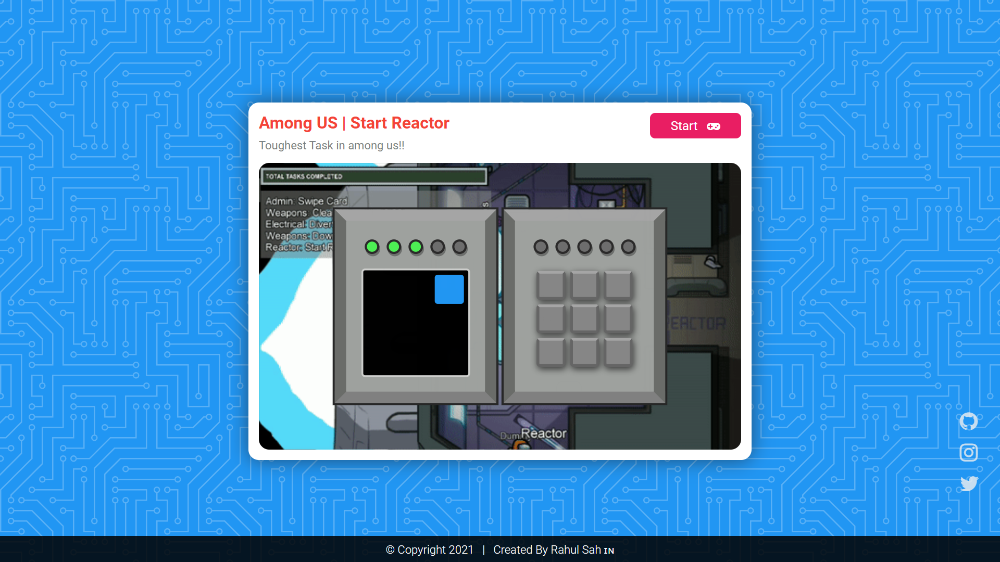

<h1>Among US | Start Reactor</h1>
<h3>Play start reactor game&nbsp;&nbsp;&nbsp;&nbsp;<a href="rahulsahofficial.github.io/start_reactor/" target="black">Click to Play</a></h3>

<h4>Game Preview</h4>

<h5>Final Work</h5>

<h5>Inspiration</h5>

<h3>Details : </h3>

I like the game Among Us .
I tried to make one of its game called Start Reactor with javscript and jquery 
Just tap on the keys  as shown in the left side of the reactor to win the game.
When the player opens the task, a black screen will appear on the left while nine squares appear on the right. The player must memorize the order blue squares appear on the left screen and then replicate it using the keypad on the right. The player will have to memorize the five patterns. The first pattern to replicate will be a single square, and the second will be two squares, and so on until the maximum of five squares. It may seem daunting to memorize the patterns, but it is important to know that the patterns predictably build on each other. For example, the second pattern will always start with the blue square from the first pattern. The fifth pattern will be the four blue squares' order in the fourth pattern with the new blue square.

The player must wait until the screen on the left finishes displaying the squares before entering the keypad pattern.

If the player enters a pattern incorrectly, the blue squares will flash red and the process restarts, in the same order as before, and the player has another opportunity to memorize the pattern. The player may keep trying until they get it correct.

Green circles above the screen on the left indicate how many patterns have been successfully replicated. The green circles above the keypad on the right indicate the number of squares the player has currently selected for the pattern so far.

Go Play and Enjoy!!

